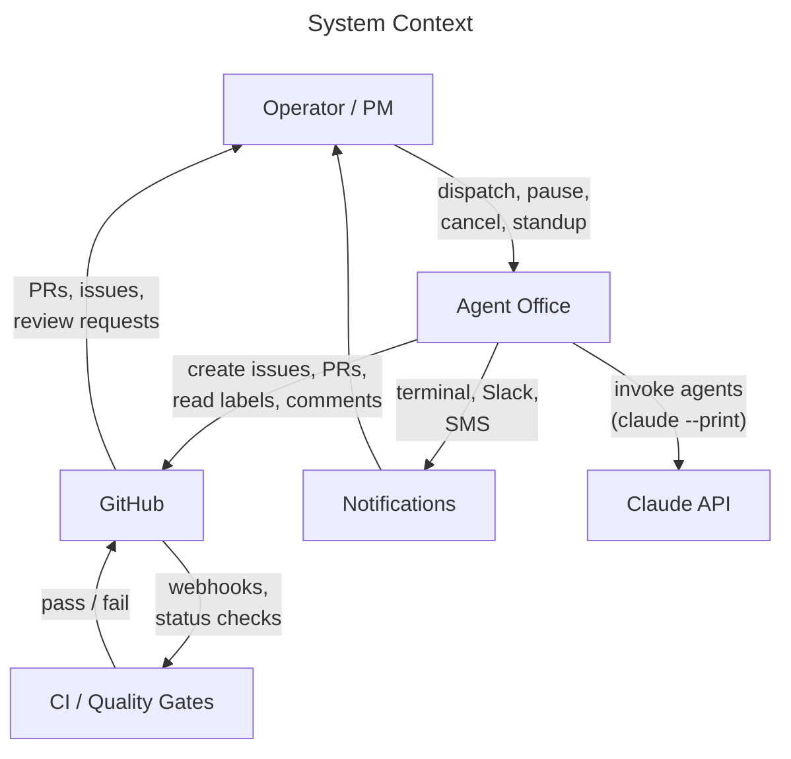
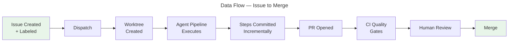
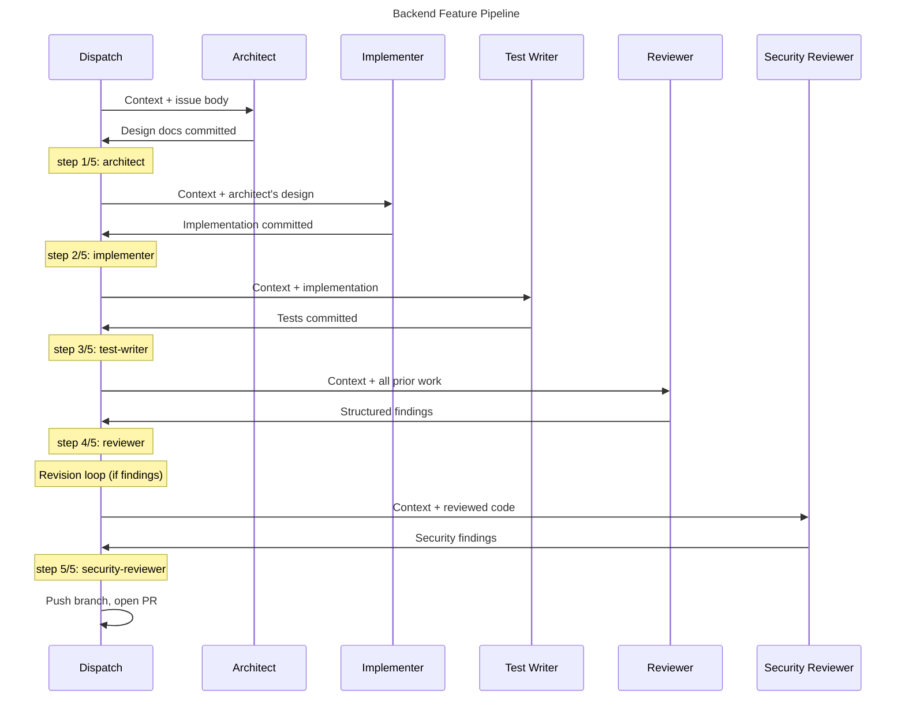
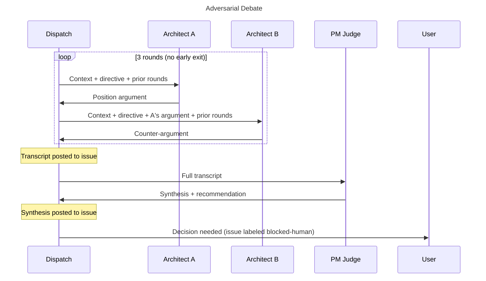
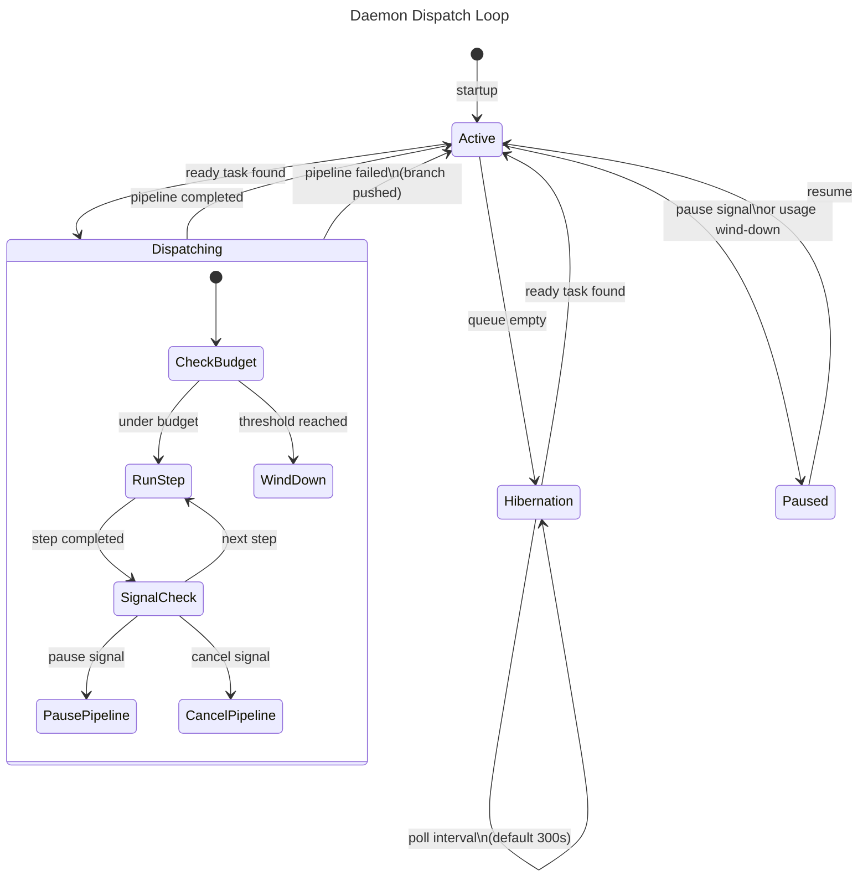
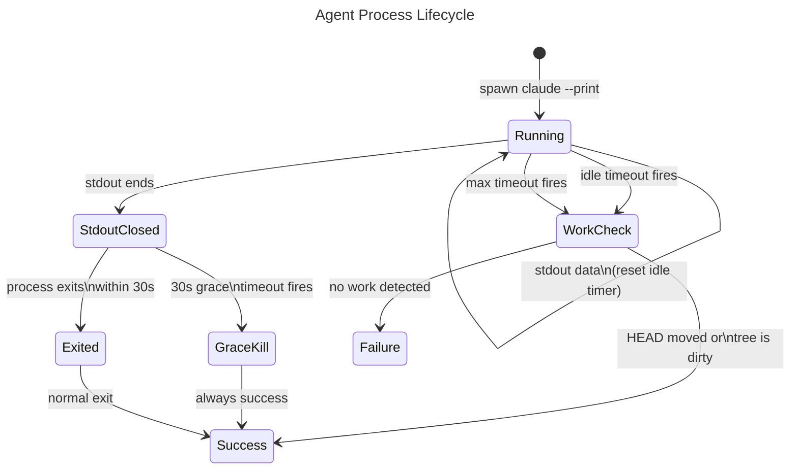
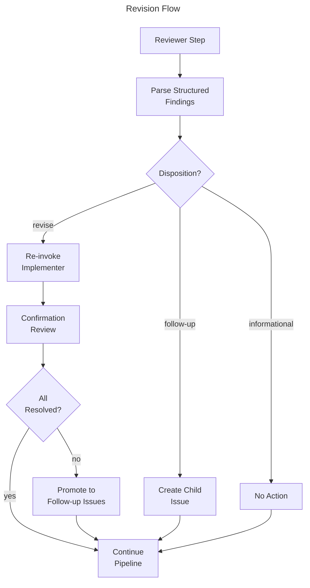

# System Overview

## What Agent Office Is

Agent Office is a forkable template that organizes AI-driven software development as a managed virtual office. A human operator acts as lead project manager. AI agents fill distinct team roles — architect, implementer, test writer, reviewer, security reviewer, UX engineer — and execute work semi-independently under mechanical process controls.

Work enters as GitHub Issues, flows through configurable multi-step pipelines, and exits as pull requests that pass CI quality gates before merging. The operator guides key decisions (architecture, domain definitions, real-world context) and reviews output. Agents run autonomously until they hit an information gap or a preset endpoint.

The system is deliberately mechanical: the dispatch infrastructure is scripts and process controls, not intelligence. Intelligence lives entirely in the agents. This separation means the orchestration layer is predictable, debuggable, and doesn't make judgment calls.

## System Context

How Agent Office fits into its ecosystem:



## How Work Flows Through the System

The happy path from issue to merged code:



Each issue carries two labels that drive dispatch: a **status label** (`status:ready`, `status:in-progress`, `status:blocked-human`, etc.) and a **pipeline label** (`pipeline:backend-feature`, `pipeline:bug-fix`, etc.). The status label tracks lifecycle state. The pipeline label selects which sequence of agents runs.

## Agent Roles and Model Routing

Roles are split across two model tiers: Opus for judgment-critical work, Sonnet for throughput work.

| Role | Model | Purpose |
|---|---|---|
| PM | Opus | Coordination, synthesis, dispatch, debate judging |
| Architect | Opus | Design decisions, adversarial debate |
| Security Reviewer | Opus | Vulnerability and auth auditing |
| Implementer | Sonnet | Code writing |
| Test Writer | Sonnet | Test authoring against code they didn't write |
| Reviewer | Sonnet | Read-only code review with structured findings |
| UX Engineer | Sonnet | Frontend implementation and UI/UX review |

The split is overridable per-role in `office.config.yml`. The rationale: Opus excels at nuanced judgment and multi-factor tradeoff analysis. Sonnet is faster and cheaper for well-scoped execution tasks where the problem space is already defined.

## Pipeline Patterns

A pipeline is a YAML file in `pipelines/` that defines a sequence of agent roles. There are 9 built-in pipelines spanning four orchestration patterns:

**Sequential** — most pipelines follow a linear handoff chain where each agent's output feeds the next:
- `backend-feature`: architect → implementer → test-writer → reviewer → security-reviewer
- `frontend-feature`: architect → implementer → ux-engineer (build) → test-writer → ux-engineer (review) → reviewer
- `fullstack-feature`: architect → implementer (backend) → implementer (frontend) → ux-engineer → test-writer → reviewer → security-reviewer
- `bug-fix`: implementer → test-writer → reviewer
- `refactor`: architect → implementer → test-writer → reviewer
- `chore`: implementer → reviewer

**Group Chat (Adversarial)** — two agent instances argue opposing positions, then a third synthesizes:
- `architecture-decision`: architect A ↔ architect B (3 rounds) → PM judge → user decision

**Handoff** — dispatch routing from issue labels to pipeline selection to agent assignment. The operator (or daemon) selects which issue to dispatch; the pipeline label determines the agent sequence.

**Blocking** — a `user` step pauses the pipeline for human input:
- `planning`: PM proposes tasks → user approves

**Single-role** — a single agent produces output with no further pipeline steps:
- `retrospective`: PM produces quantitative report

## The Pipeline Sequence

How a typical sequential pipeline (backend-feature) executes:



Each step's changes are committed to the worktree branch as `step N/M: role`. Steps that produce no file changes get no commit. This format enables the step-resume mechanism: on re-dispatch after a failure, the system reads commit history to skip already-completed steps.

## The Adversarial Debate

How the architecture-decision pipeline reaches a design decision:



The debate always runs to the configured round cap (default 3). There is no early exit on agreement — research showed ~24% of disputed questions produce wrong-consensus convergence where both instances agree on the same incorrect answer. Running all rounds surfaces disagreements that premature agreement would hide.

## The Dispatch Loop

The daemon's autonomous cycle for dispatching work:



In manual mode (`dispatch_mode: manual`), the operator runs `office dispatch` to send the next ready task. In daemon mode, the loop runs continuously: poll for `status:ready` issues, dispatch the highest-priority one, check for signals between steps, and hibernate when the queue is empty.

Usage-aware wind-down tracks cumulative agent wall-clock time. When `agentTimeElapsed / sessionBudget >= usageThresholdPct / 100`, the daemon finishes the current step, pushes the branch, pauses the issue, and stops.

## The Agent Process Lifecycle

How a single agent invocation is managed:



The `invokeAgent` function manages two timeout phases. While the agent produces output, an idle timer (default 300s) resets on each data event — a genuine hang fires the timer. Once stdout closes (output complete), both timers are cancelled and a short 30s exit grace period starts. If the process lingers past the grace period, it is killed with **success** disposition — the work product is committed, and the hang is an external CLI behavior (`claude --print` staying alive after finishing).

Before any timeout kill is treated as failure, the system checks for work: first by comparing HEAD before and after, then by checking `git status --porcelain` for uncommitted changes. If the agent produced work, the kill resolves as success.

## The Revision Flow

How reviewer findings drive automated fixes:



Reviewers output structured findings in a JSON block delimited by `<!-- FINDINGS_START -->` / `<!-- FINDINGS_END -->` markers. Each finding carries a `disposition`: `revise` (fix on this branch), `follow-up` (create a new issue), or `informational` (no action).

Loop prevention is strict: `max_revision_rounds` (default 1, 0 disables) allows exactly one revision cycle. The confirmation review's findings only produce follow-up issues, never another revision. Revision commits use `revision {round}: {role}` format, distinct from pipeline commits, so they don't interfere with step-resume.

## Where Things Live

```
project-root/
├── office.config.yml          # All toggleable settings
├── CLAUDE.md / AGENTS.md      # Agent behavioral rules
├── ARCHITECTURE.md            # Living system design (edited in place)
├── PITFALLS.md                # Non-obvious anti-patterns
├── office/                    # Dispatch system (self-contained)
│   ├── src/                   #   TypeScript source
│   ├── specs/                 #   Harness specifications
│   └── dist/                  #   Compiled output
├── src/                       # Adopting project's source code
│   └── openspec/              #   Project specifications
├── pipelines/                 # Pipeline sequence definitions (YAML)
├── presets/                   # Stack-specific quality gate presets
├── scripts/                   # Bash wrappers for compiled scripts
└── .claude/agents/            # Agent role definitions (markdown)
```

The `office/` directory is self-contained — it holds the dispatch system, and the adopting project's code goes in `src/`. This separation means you can fork the template, drop your code into `src/`, and the orchestration layer works without modification.
